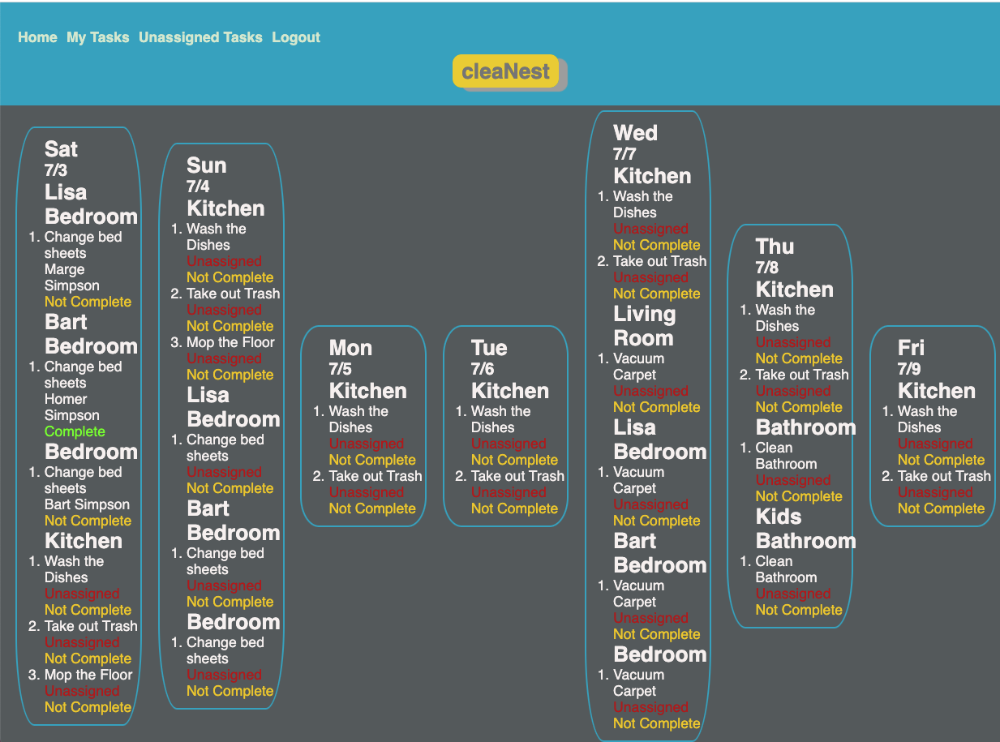

# **Project 2 Challenge**

## **Group Project: cleaNest**

Team Members

- Yajaira Gracia
- Bryan Godwin
- Colin Reinhardt

### **cleaNest** - what is it?

cleaNest helps you keep your home clean and brings your family together

Everyone knows that daily chores are a necessity. A never-ending cycle of washing, cleaning, and decluttering and other things that need to be done.

Research shows that involving children in household tasks can have a positive impact in their later life. By involving children in tasks, parents teach their children a sense of responsibility, competence, self-reliance, and self-worth that stays with them throughout their lives.

cleaNest is a simple web app that helps you manage those daily tasks as a family.

With cleaNest, you can create recurring tasks on a daily, weekly, or monthly basis, and assign them to members of your family. Each family member has their own personalized task list.

Your children will learn life skills, teamwork, responsibility & self-reliance, and planning and time management skills.

cleaNest keeps your home clean and help prepare your children for success

### **User Story**

    AS A parent running a very busy household I want to keep our home clean and organized, and  teach my children life skills, by assigning specific chores to each family member so that all members work together as a team

### **Try it out**

Try cleaNest here <https://nameless-basin-28220.herokuapp.com/>

You can log in as any member of the Simpson family:

- Homer
- Marge
- Bart
- Lisa

the same password works for all family members: _password123_

### Functionality

1.  Vvisitors (someone who is not logged in) can see all tasks for next 7 days

2.  A user (someone who is logged in) sees tasks assigned to them for next 7 days.

3.  A user can mark a task assigned to them as **complete** or **not complete**

4.  A user can see unassigned tasks. These are tasks that have been auto-created by the app.

5.  A user can assign an unassigned task to any user.

### Development Notes

We used [node-cron](https://www.npmjs.com/package/node-cron) to implememnt auto-task creation. Task creation runs daily at 2 am.

### **Group Project - code repository**

<https://github.com/godwinbw/cleaNest>

### **Group Project - live link**

<https://nameless-basin-28220.herokuapp.com/>

### **Group Project - screenshot**

<!--

-->
